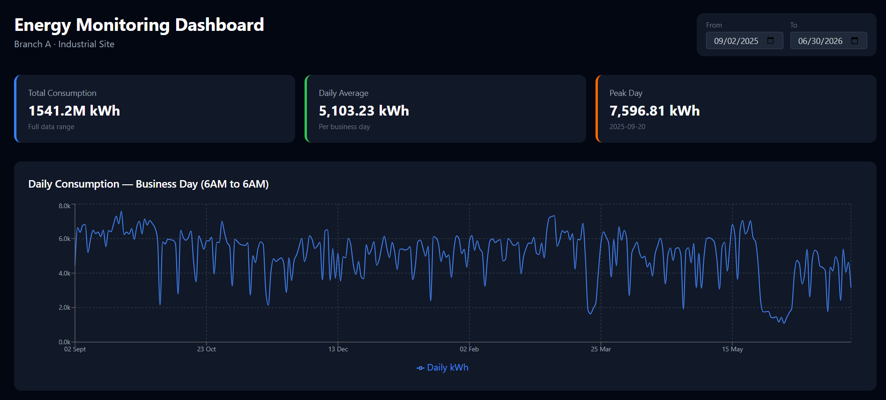
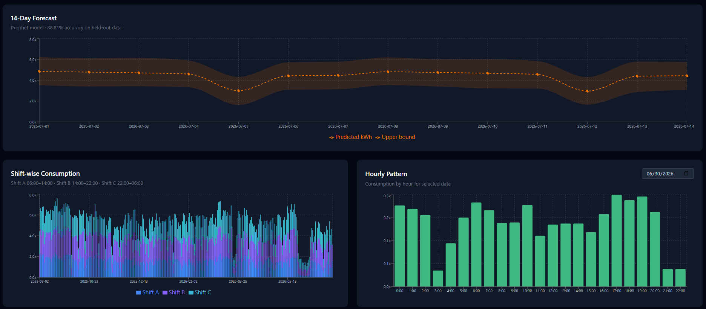

# Energy Monitoring & Forecasting Dashboard

A full-stack energy monitoring application built on real anonymized industrial meter data. The system processes raw WiFi-based smart meter readings, detects connectivity gaps, validates against billing data, and forecasts future consumption using Facebook Prophet.

## Dashboard Preview





## Project Highlights

- **99.65% pipeline accuracy** validated against a commercial BI system (Qlik Sense)
- **99.07% accuracy** validated against actual utility billing data
- **88.81% forecast accuracy** on held-out monthly data
- **96.9% accuracy** on live unseen July 2026 data
- Processes 86,784 five-minute intervals across 10 months of real meter data

## Tech Stack

| Layer | Technology |
|---|---|
| Data Pipeline | Python, Pandas |
| Forecasting | Facebook Prophet |
| Backend API | FastAPI, Uvicorn |
| Frontend | React, TypeScript, Vite |
| Charts | Recharts |
| Styling | Tailwind CSS |

## Pipeline Architecture

```
Raw Meter Data (CSV)
        ↓
01_explore.py         — EDA, data profiling
        ↓
02_clean.py            — Solar subtraction, datetime parsing, delta calculation
        ↓
03b_resample_5min.py   — 5-minute grid resampling, gap detection and filling
        ↓
04_features_5min.py    — Shift classification, business day boundary, connectivity flags
        ↓
05_forecast.py         — Prophet model training, accuracy evaluation, 14-day forecast
        ↓
FastAPI Backend         — REST API serving processed data as JSON
        ↓
React Dashboard         — Interactive charts, KPI cards, date range filtering
```

## Key Engineering Decisions

**Solar register subtraction** — Raw meter data contains a cumulative total register (`bd_zy`) that includes both grid import and solar generation. Net grid consumption is calculated by subtracting the solar register (`bd_sy`) before computing interval deltas.

**Business day boundary** — Following the site's operational convention, each business day runs from 06:00 to 06:00 the next morning. All daily aggregations use this boundary to match client reporting exactly.

**Gap detection** — WiFi connectivity gaps are detected using a two-condition logic: time gap exceeding 9 minutes AND consumption during gap exceeding 51% of the hourly average. Detected gaps are redistributed evenly across 5-minute intervals and flagged as `connectivity_issue`.

**Forecast horizon** — With 10 months of training data, the model reliably forecasts 14 days ahead based on weekly seasonality patterns. Yearly seasonality will improve significantly with a second year of data.

## Dashboard Features

- Date range filter driving all charts simultaneously
- Daily consumption line chart (business day 6AM–6AM)
- 14-day Prophet forecast with confidence intervals
- Shift-wise stacked bar chart (Shift A / B / C)
- Hourly consumption pattern for any selected date

## API Endpoints

```
GET /health    — API status
GET /summary   — KPI metrics
GET /daily     — Daily consumption (filterable by date range)
GET /forecast  — 14-day prediction with confidence bounds
GET /shifts    — Shift-wise breakdown (filterable by date range)
GET /hourly    — Hourly pattern for a selected date
```

## Setup

**Backend**
```bash
cd backend
pip install fastapi uvicorn pandas prophet scikit-learn
uvicorn main:app --reload
```

**Frontend**
```bash
cd frontend
npm install
npm run dev
```

## Data

Data anonymized from real industrial meter readings. Branch identifiers replaced with generic labels. No client-identifying information included.

## Author

Haad — Junior Data Analyst, BSc Statistics with Data Science